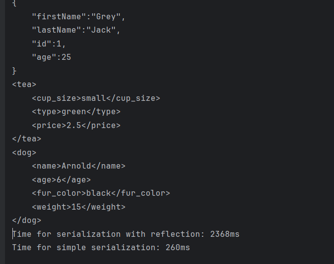

# chthonic-streams

Автор проєкту: Вікторія Сабадан, ІМ-22.

# Опис проєкту

Цей застосунок демонструє використання Java Reflection API та написання
власних анотацій для створення серіалізатора користувацьких класів
у формат JSON або XML.

Клас Serializator реалізує логіку серіалізації об'єктів у обраний
формат. У демонстраційному класі цього проєкту у головному методі
демонструється серіалізація одного об'єкту в JSON і двох - в XML. 

Анотацією @Serialized можна позначити свій клас, щоб Serializator
при виклику його методу серіалізував об'єкт, отримавши інформацію,
у який формат це треба зробити.

Анотаціями @JsonField та @XmlField необхідно позначити ті поля у класі,
які користувач хоче серіалізувати. У параметрі треба вказати назву змінної при мапінгу
в необхідний формат. Якщо перед полем відповідна анотація не вказана - воно не серіалізується.

Крім того, проводиться порівняння реалізованої серіалізації за допомогою
рефлексії та серіалізації без рефлексії. Результат підтверджує те, що рефлексія
потребує в рази більше часу, і це є однією з причин уникати її при можливості.

Вивід:


# Інструкції по збірці і запуску

Для встановлення застосунку Вам необхідно попередньо встановити Java на свою машину.

### Перший варіант: використання готового JAR архіву з цього репозиторію

[serializator-xml-json.jar](serializator-xml-json.jar)

Після встановлення архіву, у консолі переходимо у директорію з ним та можемо користуватися програмою.

```
java -jar serializator-xml-json.jar
```

### Другий варіант: самостійна збірка JAR (програмний інтерфейс Intellij IDEA)

Клонуємо репозиторій і відкриваємо його в Intellij IDEA.

У меню обираємо File - Project Structure - Artifacts - + - JAR - From modules with dependencies.

Обираємо Main як головний клас та натискаємо "ОК".

Далі в меню обираємо Build - Build Artifacts - Build.

У структурі проєкту з'являється директорія "out", у якій і є наш JAR-файл. Тепер можна скопіювати його у будь-яку бажану
директорію Вашого комп'ютера.

### Третій варіант: самостійна збірка JAR (командний рядок)

Клонуємо репозиторій на свою машину. У консолі git під час знаходження
у склонованій директорії прописуємо

```
jar -cf serializator-xml-json.jar *
```

та шукаємо JAR-файл у директорії проєкту.

### Четвертий варіант: клонування цього репозиторію на сво машину та запуск з інтерфейсу IDE

Клонуємо репозиторій та відкриваємо у середовищі розробки. Запускаємо метод Main.main().